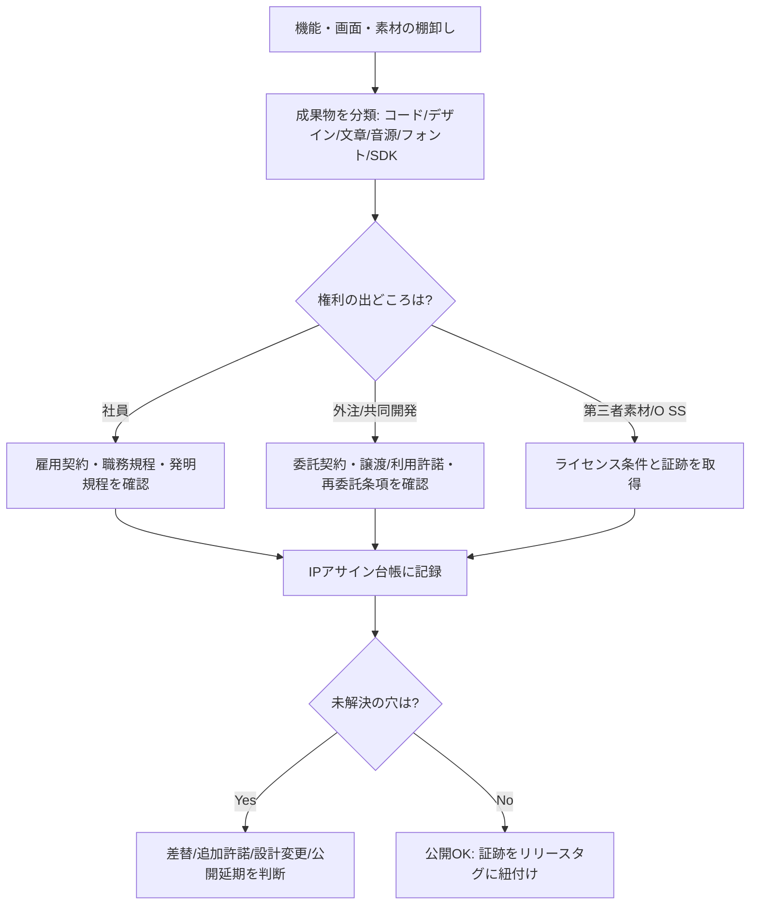
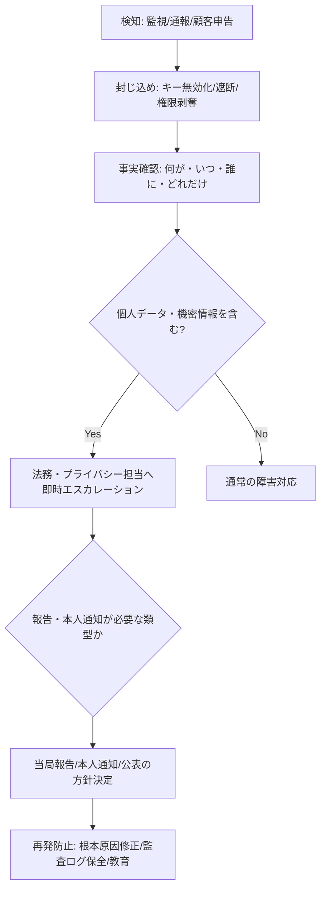

# 公開前に必ず確認したいソフトウェア法務チェック実務ガイド

## エグゼクティブサマリー

本レポートは、法務の専任者がいない小規模スタートアップが、日本で一般的な消費者向けモバイル／Webアプリを公開する前に、**「致命傷（差止・配信停止・大規模な損害賠償・行政対応）」を避ける**ための、実務的・優先度付きチェックリストと検証方法をまとめたものです（法律助言ではなく一般情報です）。

公開前に特に優先すべきは、次の4領域です。

第一に、**権利の“穴”を塞ぐ（自社が権利者であることを証明できる状態）**です。契約書の未整備（共同創業者・退職者・外注先・デザイナー等）や、第三者素材（フォント・イラスト・写真・音源・動画・UI素材）の混入は、著作権侵害や差止の典型要因です。著作権は原則として創作と同時に発生し、登録がなくても権利が生じ得ます。citeturn9search14turn9search0

第二に、**プライバシー／データ保護の“説明責任”を満たす**ことです。日本では個人情報保護委員会がガイドライン（通則編、外国第三者提供編、確認・記録義務編など）を体系化しており、越境移転（外国にある第三者提供）や第三者提供の確認・記録など、実務でつまずきやすい論点が明確化されています。citeturn22search0turn22search2turn22search13　漏えい等が「個人の権利利益を害するおそれが大きい」場合には、個人情報保護委員会への報告・本人通知の枠組みがあり、委員会は対応手順や様式も提供しています。citeturn18search3

第三に、**オープンソース／第三者ライブラリのライセンス遵守**です。特にコピーレフト（GPL/LGPL/AGPL等）や、配布形態により義務が変わるライセンスは、後からの除去コストが高く、調達・提携・M&Aでも必ず確認されます。Apache-2.0やGPLの条文上の義務（通知、ライセンス文の同梱、ソース提供等）は一次資料で要点を把握できます。citeturn5search5turn5search9turn5search7turn5search39

第四に、**消費者向け規約・表示・マーケの適法性**です。日本では、オンライン販売（通信販売）を行う場合の表示義務などを定める特定商取引法、免責や損害賠償予定条項を制限する消費者契約法、不当表示を規制する景品表示法、広告メール等を規制する特定電子メール法などが、一般アプリでも直撃し得ます。citeturn3search2turn3search3turn9search3turn10search0

加えて、近年重要度が上がっているのが、**アクセシビリティ（合理的配慮）**です。日本では、民間事業者による合理的配慮の提供が義務化された旨が内閣府資料で明示されています（2024年4月1日施行）。citeturn16search0　技術標準としては、デジタル庁がウェブアクセシビリティ導入ガイドブックを公開し、JIS X 8341-3:2016等に触れています。citeturn7search3

## 優先アクションプラン

次の計画は「日本で公開しつつ、将来EU/米国ユーザーも想定（国は未特定）」という前提で、**最小コストで“公開に耐える法的確度”を上げる順序**です。

| 期間 | 最優先ゴール | 具体アクション（最小セット） | 想定オーナー |
|---|---|---|---|
| 公開前 48–72時間 | “差止・配信停止”の主要原因を除去 | ①権利帰属（雇用/業務委託/共同創業者）を一枚の台帳にし、未署名を即回収（署名済みPDF保管） ②OSS/SDKのSBOM（依存関係一覧）を出し、GPL/AGPL等が混じっていないか一次判定 ③プライバシーポリシー（収集データ・目的・第三者提供・越境・問合せ先）を現実の実装に合わせて修正 ④利用規約に最低限（禁止事項・責任制限・準拠法・裁判管轄）を入れる（ただし消費者契約法に反しない）citeturn10search3turn3search3 | CEO/PM（責任者）、エンジニア、外部弁護士（スポット） |
| 公開前 1–4週間 | “監査に耐える証跡”を整備 | ①第三者コンテンツ（画像/音/フォント/動画/AI生成物の利用条件含む）棚卸しと証跡 ②商標の簡易クリアランス（J-PlatPat等）＋早期出願検討citeturn1search1turn3search1 ③漏えい対応手順（報告・本人通知の判断）をテンプレ化citeturn18search3turn22search12 ④外部送信（Cookie/SDK）に該当し得る場合の通知・公表導線の整備（該当性の一次判定）citeturn15search6turn11search0 | PM、法務（外部でも可）、セキュリティ担当 |
| 公開後（継続） | “変化”への追随（SDK追加・国展開・広告導入） | ①ライセンス/データ取扱いの変更管理（PRテンプレ） ②脆弱性対応とセキュリティ標準の運用（OWASP/NIST等を参照）citeturn8search1turn8search2 ③越境移転やターゲット国が決まった時点でGDPR/CCPAの適用性を再評価（域外適用を含む）citeturn19search19turn20search0turn21search0 | エンジニアリングマネージャ、CISO相当、外部専門家 |

## ローンチ前法務チェックの総合チェックリスト

下表は、依頼のあった各ディメンションについて「最低限ここまでやれば、公開判断に合理性が出る」という実務セットです。費用は案件で大きく変動するため、**幅を広め**に取り、外部専門家を使う場合の例も併記します（公式手数料は公的資料、それ以外は公表例・相場情報に基づく目安）。citeturn3search1turn17search0turn17search3turn17search8

| 領域 | 何を確認するか（要点） | 実務チェック（公開前の具体手順） | リスク | 主な緩和策 | 目安工数・費用（概算） | 次に相談すべき相手 | 根拠（一次資料中心） |
|---|---|---|---|---|---|---|---|
| 特許リスク（FTO） | 他社特許を侵害せず実施できるか（差止・損害賠償） | ①「機能一覧（ユーザー価値）」と「実装要素（アルゴリズム/通信/認証/課金/UI挙動）」を分解 ②競合・主要プレイヤーの特許出願/登録を検索し、**クレームを読む** ③高リスク領域は設計変更（design-around）案を用意 ④結論と根拠（検索式・対象期間・対象国）を文書化 | 高 | 先行調査＋設計回避、特許侵害予防調査（弁理士レビュー）、保険 | 工数: 3–10人日。外部: 30万–100万円超（範囲次第）citeturn17search0turn17search7turn1search0turn1search1 | entity["organization","弁理士","patent attorney jp"]、知財担当 | entity["organization","特許庁","japan patent office"]資料（IP戦略・クリアランス/侵害予防の考え方）citeturn1search0turn1search1 |
| 特許（先行技術）・出願戦略 | 出願すべき発明の抽出、公開前の手当 | ①「差別化要素」を発明候補として整理 ②公開予定日（AppStore/PR/営業資料）から逆算し、先に出願要否を判断（公開で新規性が失われ得る） ③国内→PCT等のロードマップと予算を作る | 中 | 先行技術調査、仮説クレーム作成、出願前の公開管理（NDA） | 工数: 2–8人日。外部: 調査5–20万円、出願は別（公式手数料＋代理人費用）citeturn17search18turn3search1turn1search0 | entity["organization","弁理士","patent attorney jp"] | entity["organization","特許庁","japan patent office"]手数料・制度案内citeturn3search1turn1search0 |
| 著作権（ソースコード/コンテンツ/UI） | 自社が利用権限を持つか、第三者素材を侵害していないか | ①リポジトリのCOPYRIGHT/NOTICE、デザインFigma、素材フォルダを棚卸し ②外注・共同開発・退職者の成果物について譲渡/利用許諾の証跡を回収 ③画像・動画・音源・フォント・アイコン・UIキットのライセンス条件（商用可、改変可、クレジット要否、再配布可否）を台帳化 ④ストア掲載画像/説明文も含めて権利確認 | 高 | 代替素材に差替、権利許諾の追加取得、社内制作化 | 工数: 3–10人日。外部: 10–30万円（レビュー） | entity["organization","弁護士","japan attorney"]（IP/IT）、契約担当 | 著作権は創作時に発生し得るciteturn9search14／著作権法citeturn9search0 |
| 商標（名称/ロゴ/ブランド） | 名前・ロゴが他社の登録商標や周知表示と衝突しないか | ①候補名をJ-PlatPat等で同一/類似検索（称呼・類似群コードの観点も） ②ドメイン/SNSハンドルも同時確認 ③重要なら先に出願（区分設計） ④ロゴは類似調査＋著作権も確認 | 高 | リネーム、区分設計、早期出願、共存交渉 | 工数: 1–4人日。公式手数料は区分数で変動（例: 1区分出願12,000円等）。代理人費用は幅広い（数万〜十数万円等）citeturn3search1turn17search15turn17search8turn1search1 | entity["organization","弁理士","patent attorney jp"]、ブランド担当 | entity["organization","特許庁","japan patent office"]（検索・手数料）citeturn1search1turn3search1 |
| 営業秘密・ノウハウ | 秘密情報として保護できる状態（秘密管理性等）を作る | ①秘密情報の範囲定義（例: 学習データ、推薦ロジック、営業リスト、ロードマップ） ②アクセス制御（権限・ログ・退職時剥奪） ③NDA、持出し禁止、管理標識、教育 ④委託先にも同等の管理条項 | 中 | “秘密として管理している”証跡を残す（運用） | 工数: 2–6人日。外部: 0–20万円（規程レビュー） | entity["organization","経済産業省","meti tokyo jp"]の資料を参照しつつ、弁護士 | entity["organization","経済産業省","meti tokyo jp"]の営業秘密管理の考え方citeturn1search3 |
| 従業員・外注の知財帰属（職務発明含む） | 「誰が権利者か」が曖昧でないか（後から争点化） | ①雇用契約/就業規則/委託契約に、成果物の帰属・譲渡・利用許諾・再委託・OSS持込み禁止/申告を明記 ②職務発明の取り扱い（社内規程・対価）を整備 ③共同創業者・業務委託・インターンの“抜け”を潰す | 高 | 標準契約テンプレ化、署名回収、IPアサインの定期監査 | 工数: 2–8人日。外部: 10–30万円（雛形作成/改定） | entity["organization","弁護士","japan attorney"]、entity["organization","弁理士","patent attorney jp"] | 職務発明（特許法）citeturn3search0 |
| OSS/第三者ライブラリ（互換性・義務） | ライセンス義務（表示・通知・ソース開示等）を満たせるか | ①SBOM（依存関係一覧）作成（ビルド成果物単位） ②ライセンス種別を機械判定＋人手レビュー ③配布形態（アプリ配布/SaaS/SDK再配布）ごとに義務を確定 ④NOTICE/ATTRIBUTION画面・同梱ファイルを用意 | 高 | コピーレフト回避（置換/隔離/例外確認）、デュアルライセンス検討 | 工数: 2–10人日。外部: 0–50万円（ツール/レビュー） | OSSコンプライアンス経験者、弁護士（必要時） | Apache/GPL等の一次資料citeturn5search5turn5search9turn5search7turn5search39 |
| プライバシー（日本APPI中心） | 実装がガイドラインに沿い、説明・同意・安全管理・委託管理ができているか | ①データマップ（何を/どこで/誰が/何目的で/どこへ） ②利用目的の特定・通知/公表 ③委託先管理（クラウド・分析SDK） ④第三者提供の要否判定、記録/確認 ⑤漏えい時手順（報告・通知） | 高 | データ最小化、同意設計、委託契約、ログ・暗号化 | 工数: 5–15人日。外部（規約＋PP作成等）: 10–30万円程度の公表例もあるciteturn17search3turn17search12 | entity["organization","個人情報保護委員会","japan ppc"]のガイドラインに強い弁護士 | ガイドライン通則編/外国第三者提供/確認・記録義務citeturn22search0turn22search2turn22search13／漏えい対応citeturn18search3 |
| 越境移転（外国第三者提供） | 国外クラウドや海外委託先への提供が「外国にある第三者」提供に当たるか | ①データ所在（リージョン）と受領者の法的地位を確認 ②同意が必要なケースの判定 ③同意取得時に提供すべき情報（国名、制度情報、保護措置等）を準備 ④提供記録・受領確認記録を残す | 高 | 国内リージョン利用、提供先の措置の契約化、同意UI改善 | 工数: 2–8人日。外部: 10–30万円（設計/条項レビュー） | プライバシー弁護士 | 外国第三者提供ガイドライン/FAQciteturn22search2turn22search5 |
| クッキー/SDK等の外部送信（該当時） | 分析SDK・広告SDKが「外部送信規律」等に触れ得るか（対象役務の場合） | ①SDKごとに送信情報・送信先・目的を一覧化 ②対象役務/対象事業者に該当するか一次判定 ③通知・公表・同意・オプトアウトのいずれで対応するか決める | 中 | SDK最小化、送信先分離、通知導線の整備 | 工数: 2–6人日 | 通信・プライバシーに詳しい弁護士 | entity["organization","総務省","mic tokyo jp"]領域の規律（電気通信事業法やガイドラインの解説）citeturn11search0turn15search6 |
| 消費者保護・EC表示・マーケ | 誇大広告、返金・解約、価格表示、広告メール等 | ①課金がある場合、特商法の表示（事業者情報・価格・支払時期・提供時期・返品等） ②景表法（“No.1”“必ず痩せる”等）に触れる表示の排除 ③解約・返金・自動更新の明確化 ④広告メールはオプトイン等の要件確認 | 高 | 広告表現の根拠資料管理、表示テンプレ、メール同意管理 | 工数: 2–8人日。外部: 10–30万円（規約/表示レビュー） | 消費者法務に強い弁護士 | 特商法citeturn3search2／景表法citeturn9search3turn9search21／特定電子メール法citeturn10search0turn9search2 |
| 利用規約・免責・損害賠償・準拠法 | 免責条項が無効化されない設計（消費者契約） | ①責任制限が「故意/重過失」を免責していないか ②“法律上許される限り”の曖昧免責（サルベージ条項）による無効化リスクを点検 ③準拠法・管轄・禁止事項・アカ停止等の統治条項 | 高 | 条項の明確化、消費者契約法の逐条解説を踏まえた修正 | 工数: 2–6人日。弁護士費用の公表例: 10–20万円等citeturn17search3turn3search3turn10search3 | entity["organization","消費者庁","caa tokyo jp"]資料も参照できる弁護士 | 消費者契約法と逐条解説citeturn3search3turn10search3turn10search1 |
| セキュリティ標準・脆弱性対応 | “安全管理措置”の実装と、侵害時の対応能力 | ①最低限のセキュリティ基準（OWASP/NIST参照）を社内標準化 ②脆弱性診断（自動＋手動） ③TLS設定、ログ、鍵管理、脆弱性開示窓口 ④インシデント対応（初動/封じ込め/報告） | 高 | セキュリティ開発ライフサイクル、外部診断、教育 | 工数: 5–20人日＋継続。外部診断は数十万〜（範囲次第） | セキュリティ責任者、外部診断会社 | entity["organization","IPA","information-technology promotion agency jp"]の安全な実装ガイドciteturn8search0turn8search12／entity["organization","NIST","us nist"]CSF 2.0citeturn8search2turn8search6／entity["organization","OWASP","owasp foundation"]MASVSciteturn8search1 |
| 輸出管理・制裁 | 暗号・提供先国・制裁対象との取引リスク | ①強力な暗号を含む場合、輸出管理（技術提供/クラウド提供含む）を一次判定 ②制裁対象国・個人への提供遮断（スクリーニング） ③越境提供の社内ルール化 | 中（通常アプリは低〜中） | 対象国制限、暗号分類/届出、制裁コンプラ | 工数: 1–5人日（通常）。外部: 必要時のみ | 輸出管理に詳しい法務/entity["organization","経済産業省","meti tokyo jp"]相談窓口 | 日本の安全保障貿易管理（外為法枠組み等）citeturn6search4turn6search12turn6search0／entity["organization","BIS","us bureau of industry and security"]暗号輸出citeturn6search17turn6search1／entity["organization","OFAC","us treasury ofac"]コンプラ枠組みciteturn6search10／EUデュアルユースciteturn6search11turn6search7 |
| 業種別トリガー（健康・金融・子ども等） | “うっかり業規制”に入らないか | ①子ども向け/13歳未満を対象にする可能性の有無 ②決済・前払式・暗号資産など金融機能の有無 ③健康・医療に関する効能効果の表示の有無 | 中〜高（該当時） | 対象年齢制限、機能分離、表示レビュー | 工数: 2–10人日（該当時） | プライバシー弁護士、業法専門弁護士 | 子ども: COPPA（米国）citeturn23search2turn23search6／GDPR子どもの同意citeturn23search23 |
| アクセシビリティ・合理的配慮 | 障害のある利用者が使えるよう配慮し、リスクを下げる | ①問い合わせ導線を“文字でも”提供 ②主要画面をWCAG観点で点検 ③アクセシビリティ方針・改善プロセスを明文化 | 中（社会的・訴訟リスク含む） | WCAG準拠の設計、テスト手順、代替手段 | 工数: 2–10人日（初回） | アクセシビリティ専門家、弁護士 | 事業者の合理的配慮義務化（内閣府）citeturn16search0／entity["organization","デジタル庁","digital agency japan"]ガイドciteturn7search3／WCAG 2.2日本語訳citeturn7search4 |

## データ保護・プライバシーの法域別比較

ここでは「将来どの国のユーザーが来ても破綻しにくい」観点で、**日本（APPI）／EU（GDPR）／米国（連邦の一般枠組み＋カリフォルニア）**を、実務上重要な点に絞って比較します。EUは域外適用（一定の条件でEU域外企業にも適用）という特徴があり、公開直後でも想定外に対象となることがあります。citeturn19search19turn19search11

| 論点 | 日本（APPI） | EU（GDPR） | 米国（連邦） | 米国（カリフォルニア：CCPA/CPRA） |
|---|---|---|---|---|
| 収集時の開示（Notice） | 利用目的の通知/公表等が中心（制度詳細はガイドライン体系で補完）citeturn22search1turn22search3 | 収集時に提供すべき情報（目的、法的根拠、保存期間、権利、越境等）が詳細に列挙citeturn20search24 | 一般法としては「不公正・欺瞞的（unfair/deceptive）」を禁止する枠組みが中心で、虚偽/不十分な表示が問題化し得るciteturn21search6turn21search14 | 収集時点（at or before point of collection）のnotice at collectionが要求され、カテゴリと目的等を示す必要citeturn21search0turn21search1 |
| 収集・利用の原則 | “何のために集めるか”を先に定義し、目的外利用を抑制する方向（通則ガイドラインで実務整理）citeturn22search1 | データ最小化・目的限定・透明性などの原則が明文化citeturn20search0 | セクター別（子ども、医療、金融等）＋UDAP中心 | “収集目的の通知”と、消費者権利対応（開示/削除/オプトアウト等）の手続が重要citeturn21search0turn21search1 |
| 同意/法的根拠 | ケースにより同意が必要（例：外国第三者提供など）citeturn22search2turn22search5 | 処理の適法化には複数の法的根拠（同意、契約、正当利益等）citeturn20search5 | 子ども等は同意がトリガーになりやすい（COPPA等）citeturn23search2turn23search6 | “販売/共有のオプトアウト”など、権利行使UIが実務上の中核になりやすい（義務の詳細は条文・当局FAQ等で確認）citeturn21search0turn21search1 |
| 越境移転 | 「外国にある第三者」提供には、同意取得時に提供すべき情報が追加され、提供先国の制度情報等の確認が求められるciteturn22search5turn22search2 | 第三国移転はGDPRの条件（適合性/適切な保護措置等）に従う。一般原則と適合性決定の考え方citeturn20search7turn20search3 | 輸出規制・制裁が別軸で効くことがある（データ保護としての一般法は限定的） | 州法としての越境移転の枠組みはGDPRほど統一的ではないことが多い（ただし個別契約・セキュリティ義務等が問題化し得る） |
| 委託（Processor契約/DPA） | 委託先管理は安全管理措置・委託管理として実務上重要（ガイドラインで詳細化）citeturn22search1turn22search0 | Processor利用時の契約要件（Art. 28）と、記録（Art. 30）等の説明責任citeturn19search24turn19search29 | 契約とUDAP、セクター規制 | サービスプロバイダ等の整理と、権利対応手続の整備が重要（条文解釈は条文で）citeturn21search0turn21search1 |
| 侵害・漏えい報告 | 漏えい等対応の実務資料・報告フォーム等が提供されているciteturn18search3 | 監督機関への通知72時間など（Art. 33）citeturn18search10turn18search18 | 州ごとの漏えい通知法が中心（全州に存在する旨の整理）citeturn18search1 | 漏えい通知（Cal. Civ. Code 1798.82）などが別体系で存在し、要件・期限・AG提出等が規定されるciteturn18search0turn18search8 |
| 子どもデータ | 年齢一般の包括規制はEU/USほど明確でないが、慎重な同意設計・目的限定が安全 | 子どもの同意（Art. 8）や、子ども向け説明の明確化が論点になり得るciteturn23search23turn20search16 | COPPAは13歳未満の子ども向け/実質的に収集を知っている場合に要件citeturn23search2turn23search6 | 子ども向けは追加リスク（詳細は都度確認） |

補足として、EU→日本の個人データ移転については、EUが日本を「十分性（adequacy）」と判断した決定があり、制度的には移転のハードルが下がる一方、対象・条件（補完ルール等）を正しく理解する必要があります。citeturn23search0turn23search1turn23search8

## オープンソース・ライセンス遵守

OSSは「使ってよい」が前提である一方、**守るべき義務（通知、著作権表示、ライセンス文の同梱、改変の明記、ソース提供、ネットワーク提供時の義務など）**がライセンスごとに異なります。  
公開前に最も重要なのは、(1) **何を使っているか（SBOM）**、(2) **配布・提供形態**、(3) **義務の履行手段（画面表示/同梱ファイル/配布サイト）**、(4) **将来の依存追加に対する変更管理**の4点を揃えることです。Apache License 2.0の再配布条件（通知・ライセンス文等）や、GPL系のソース提供等の考え方は一次資料で必ず確認してください。citeturn5search5turn5search9

### よく使うOSSライセンスの実務的含意

| ライセンス | 典型的な義務・注意点（実務要約） | 公開前にやること | リスク | 一次資料 |
|---|---|---|---|---|
| MIT / BSD系（2条項/3条項） | 著作権表示・免責条項等の保持が中心（許諾は広い） | ①OSS一覧に入れる ②アプリ内「ライセンス」画面 or 同梱に表示 | 低（漏れると是正が必要） | SPDXライセンス一覧citeturn5search39 |
| Apache License 2.0 | 再配布条件（LICENSE/NOTICE等）＋特許ライセンス条項が特徴 | ①NOTICE取り込み ②改変有無を管理 ③特許条項の含意を理解 | 中 | entity["organization","Apache Software Foundation","apache org"]のライセンス文書citeturn5search5turn5search7 |
| MPL 2.0 | “ファイル単位”のコピーレフト（改変ファイル公開等）になり得る | ①MPLファイル改変の有無を把握 ②配布形態に応じ公開手段を準備 | 中 | SPDXciteturn5search39 |
| LGPL（v2.1/v3） | ライブラリとしてのリンク・改変・再配布条件が論点（静的リンク等で義務が重くなる場合） | ①リンク形態を特定 ②差替可能性（リリンク可能性）等を確認 ③必要なら置換 | 中〜高（構成次第） | entity["organization","Free Software Foundation","fsf"]/GNUライセンス文書citeturn5search9turn5search10 |
| GPL（v2/v3） | 配布（convey）に伴うソース提供等の義務が問題になりやすい | ①混入を原則避ける（消費者アプリでは特に） ②入っていたら隔離/置換 | 高 | GNU GPL本文citeturn5search9 |
| AGPL | ネットワーク越し提供でもソース提供義務が問題化し得る（SaaSで特に注意） | ①バックエンドでの利用有無を特定 ②該当なら置換/公開方針決定 | 高 | GNU/AGPL系の一次資料（GPL文書群）citeturn5search9 |
| 互換性（例：Apache-2.0とGPL） | 組合せにより互換性問題が出る（例: GPLv2-onlyとの整合等） | ①依存を“配布物単位”で評価 ②疑義は専門家レビュー | 中〜高 | 互換性についての整理（Linux Foundation等）citeturn5search10 |

実務では「OSSの義務を守る」だけでなく、**“守っている証跡”**（SBOM、スキャン結果、NOTICE生成手順、バージョン更新時の再確認フロー）を残すことが、後から効きます。

## セキュリティ、アクセシビリティ、輸出管理、業種別規制の横断チェック

セキュリティは「脆弱性があること」自体よりも、**(1)守るべき情報の特定、(2)予防、(3)検知、(4)初動、(5)報告・再発防止**を回せるかが実務の勝負です。NIST CSF 2.0はガバナンス（Govern）を含む枠組みとして整理され、組織の優先順位付けに使えます。citeturn8search2turn8search6　日本の実装寄り資料としては、IPAの「安全なウェブサイトの作り方」やTLS暗号設定ガイドラインが、具体的な実装上の落とし穴に直結します。citeturn8search0turn8search12　モバイルアプリ特有の観点はOWASP MASVSが指標になります。citeturn8search1

漏えい時の対応は、個人情報保護委員会の「漏えい等の対応とお役立ち資料」に基づき、**報告・本人通知の要否判断と、提出書式の準備**をテンプレ化しておくことが現実的です。citeturn18search3turn22search12　EUを視野に入れるなら、監督機関への通知（72時間の原則など）を含むGDPR Art. 33の考え方も前提として理解しておくと、社内プレイブックが作りやすくなります。citeturn18search10turn18search18　米国は州別の漏えい通知法が中心で、カリフォルニアではCal. Civ. Code 1798.82の枠組み（通知内容・AG提出など）が別体系として存在します。citeturn18search0turn18search8

アクセシビリティは、法令上は「合理的配慮」義務の観点が重要で、内閣府は民間事業者の合理的配慮提供が義務化された旨を明確にしています。citeturn16search0turn16search7　一方、実装の現場では、デジタル庁の導入ガイドブック（JIS X 8341-3:2016を参照する前提）と、WCAG 2.2等を使って“点検可能な要求”に落とすのが現実的です。citeturn7search3turn7search4turn7search15　EUに提供するなら、European Accessibility Act（EAA）も市場アクセスの観点で将来的な論点になり得ます。citeturn7search1turn7search9

輸出管理・制裁は、多くの一般アプリでは優先度が下がりますが、**強力な暗号機能**や、**制裁対象国/個人への提供**、**海外拠点への技術提供（クラウドを含む）**が絡むと急に重要になります。日本の安全保障貿易管理は外為法に基づく枠組みで整理され、entity["organization","経済産業省","meti tokyo jp"]の資料・Q&Aが入口になります。citeturn6search4turn6search0turn6search12　米国は暗号輸出規制（EAR）の枠組みがあり、entity["organization","BIS","us bureau of industry and security"]はEncryption controlsの解説も提供しています。citeturn6search17turn6search1　制裁はentity["organization","OFAC","us treasury ofac"]の「コンプライアンス枠組み」が基本形で、最小でも“誰に提供しているか”の確認プロセス（KYCに近い）が現実解です。citeturn6search10

最後に、子ども向け・健康・金融は「うっかり業規制」に入りやすい領域です。米国ではCOPPAが13歳未満の子ども向けオンラインサービス等に一定の要件を課し、規則本文（16 CFR Part 312）とFTCの解説が一次情報になります。citeturn23search2turn23search6　EUでは子どもの同意（Art. 8）などが論点になります。citeturn23search23turn23search3

## 必要なドキュメントと監査プロセス図

### 公開前に最低限そろえるべき文書セット

「作ること」より「**更新される運用**」が重要です（SDK追加・広告導入・海外展開で必ず変わります）。

- IP・契約
  - IPアサイン台帳（社員/外注/共同創業者、成果物、契約日、署名証跡）
  - 職務発明・秘密情報取り扱いの社内ルール（最小でもポリシー文書）
  - 商標調査ログ（検索語、スクショ/結果、判断）
- OSS
  - SBOM、ライセンス一覧、NOTICE生成物、配布物ごとの同梱チェック結果（リリース毎）
- プライバシー
  - データマップ（収集カテゴリ、目的、保存、提供先、委託先、越境）
  - プライバシーポリシー／同意画面仕様（実装との突合証跡）
  - 第三者提供の確認・記録（必要な場合）citeturn22search13
- セキュリティ・事故対応
  - インシデント対応手順（報告・本人通知の判断表を含む）citeturn18search3turn22search12
  - 脆弱性管理（SLA、修正優先度、公開窓口）
- EU想定が現実化した時に追加
  - Processor契約（DPA相当；Art. 28）citeturn19search24turn19search16
  - 処理記録（RoPA；Art. 30）citeturn19search29
  - DPIA（高リスク時；Art. 35）citeturn19search26

### プロセスフロー例（Mermaid）

#### IP監査（権利帰属と第三者素材）ワークフロー



#### 漏えい・侵害インシデント初動（最小プレイブック）



### 公式一次ソースへのショートリンク（URL）

（以下は参照用。本文中の引用リンク（citation）も一次ソースに飛べます。）

```text
- 個人情報保護委員会（ガイドライン通則編）: https://www.ppc.go.jp/personalinfo/legal/guidelines_tsusoku/
- 個人情報保護委員会（外国第三者提供編）: https://www.ppc.go.jp/personalinfo/legal/guidelines_offshore
- 個人情報保護委員会（漏えい等対応）: https://www.ppc.go.jp/personalinfo/legal/leakAction/
- e-Gov（個人情報保護法）: https://laws.e-gov.go.jp/document?lawid=415AC0000000057
- 特許庁（J-PlatPat）: https://www.j-platpat.inpit.go.jp/
- W3C WCAG 2.2: https://www.w3.org/TR/WCAG22/
- デジタル庁（ウェブアクセシビリティ導入ガイドブック）: https://www.digital.go.jp/resources/introduction-to-web-accessibility-guidebook
- EU Commission（SCC Q&A）: https://commission.europa.eu/law/law-topic/data-protection/international-dimension-data-protection/new-standard-contractual-clauses-questions-and-answers-overview_en
- FTC（COPPA）: https://www.ftc.gov/legal-library/browse/rules/childrens-online-privacy-protection-rule-coppa
```

上記URLに対応する内容（ガイドライン体系、漏えい時の対応、合理的配慮の義務化、GDPRの主要条文、CCPAのnotice at collection等）は、本レポート内で該当箇所に引用リンクを付しています。citeturn22search0turn18search3turn16search0turn20search24turn21search0turn23search6